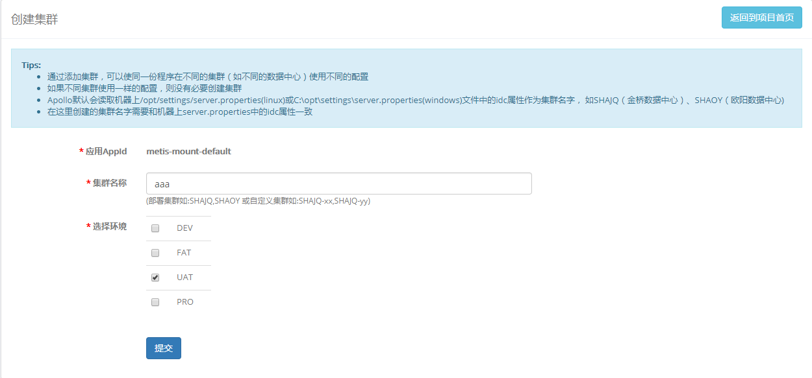
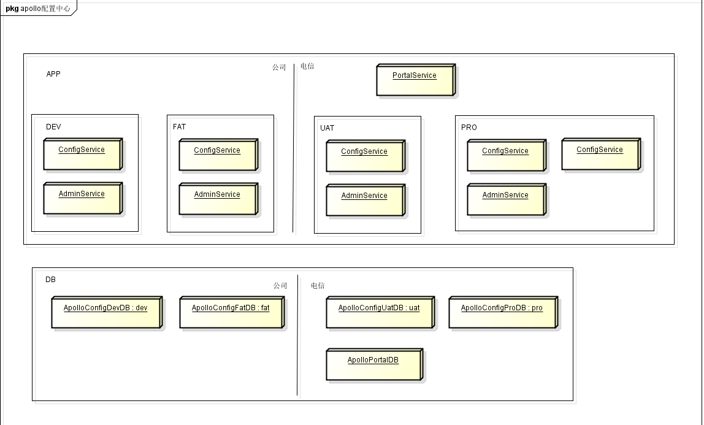



我们之前有自己开发的基于dubbo实现的配置中心, 但对比了携程apollo配置中心后, 还是果断的决定用其替换我们自己的.
 
## 比较    
| 比较项 | metis配置管理 | ctrip-apollo | 说明 |
| --- | --- | --- | --- |
| 统一配置管理 | 无 | 有 | 我们的配置管理不支持多对个环境统一进行配置, 而apollo支持 |
| 配置变更通知 | 有 | 有 | 我们的配置管理虽然有, 但实现的方式很特别(`rpc方式`),使用过程中也不是很灵活 |
| 可用性 | 弱 | 强 | metis如果挂了, 配置中心不能使用; 而ctrip-apollo支持离线方式使用 |
| 独立性 | 弱 | 强 | 是基础服务中的一个模块,如果metis挂了,配置服务不能使用; ctrip-apollo则是独立的平台 |
| 功能性 | 弱 | 强 | 1. 我们的配置管理配置维度低(仅支持group维度);ctrip-apollo支持多个维度 <br /> 2.我们的配置管理没有回滚,发布,灰度发布等功能,ctrip-apollo有 <br /> 3.我们的配置管理没有修改和发布历史, ctrip-apollo有 <br /> 4. 我们的配置管理没有权限控制,ctrip-apollo有 <br /> 5.我们的配置管理没有配置管理,ctrip-apollo有|

## 官方文档
[Apollo配置中心介绍](https://github.com/ctripcorp/apollo/wiki/Apollo%E9%85%8D%E7%BD%AE%E4%B8%AD%E5%BF%83%E4%BB%8B%E7%BB%8D "Apollo配置中心介绍")

[Apollo配置中心设计](https://github.com/ctripcorp/apollo/wiki/Apollo%E9%85%8D%E7%BD%AE%E4%B8%AD%E5%BF%83%E8%AE%BE%E8%AE%A1 "Apollo配置中心设计")

[Apollo使用指南](https://github.com/ctripcorp/apollo/wiki/Apollo%E4%BD%BF%E7%94%A8%E6%8C%87%E5%8D%97 "Apollo使用指南")

[Java客户端使用指南](https://github.com/ctripcorp/apollo/wiki/Java%E5%AE%A2%E6%88%B7%E7%AB%AF%E4%BD%BF%E7%94%A8%E6%8C%87%E5%8D%97 "Java客户端使用指南")

[分布式部署指南](https://github.com/ctripcorp/apollo/wiki/%E5%88%86%E5%B8%83%E5%BC%8F%E9%83%A8%E7%BD%B2%E6%8C%87%E5%8D%97 "分布式部署指南")

[深度剖析服务发现组件Netflix Eureka](https://zhuanlan.zhihu.com/p/24829766 "深度剖析服务发现组件Netflix Eureka")

## 快速开发指南
- hosts文件中添加DNS映射:
  ```text
  192.168.28.57 config.xyz.cn
  ```

  浏览器登录`config.xyz.cn`,依据"Apollo使用指南" 进行应用的配置
    
  
- maven添加依赖
  ```xml
    <dependency>
      <groupId>com.ctrip.framework.apollo</groupId>
      <artifactId>apollo-client</artifactId>
      <version>${ctrip.apollo}</version>
    </dependency>
  ```
  
  **注: 我们已经将不同环境的服务发现地址打入apollo-client包, 无需另外配置**
  
- 如果是windows系统, 请在系统盘中(一般为`C盘`)创建`/opt/settings/`目录; 如果是linux系统, 请在系统根路径(`/`)创建`/opt/settings/`目录.
   并在此目录下新建`server.properties`文件, 文件内容为:
   ```properties
   #env=DEV      #开发环境uncomment此行
   #env=FAT      #测试环境uncomment此行
   #env=UAT      #P版环境uncomment此行
   #env=PRO      #正式环境uncomment此行
   #env=LOCAL    #本地环境uncomment此行,本地环境不会从配置中心获取配置
   ```
   
   apollo支持有多个环境配置, 目前我们规范只使用其中的5个,分别为:
   
   - LOCAL: 本地环境, 使用之前从配置中心获取并存放在本地(`/opt/data` 目录下)的配置, 不再从配置中心获取新的配置
   - DEV: 开发环境
   - FAT: 测试环境
   - UAT: P版环境
   - PRO: 正式环境

- 应用中, 在路径`src/main/resources/META-INF/`目录下创建`app.properties`,文件内容为:
  ```properties
  app.id=${配置中心中配置的应用名称}
  ```

- 如果是在代码中获取配置, 可通过`com.ctrip.framework.apollo.ConfigService`类中的方法来获取配置信息; 另外, apollo也提供了Spring的配置方式, 
  简单的配置就支持和Spring中的`org.springframework.context.support.PropertySourcesPlaceholderConfigurer`相结合;详细说明请参考"Java客户端使用指南"
  
- dubbo配置如需要使用配置中心, 我们已经写了一个工具类(`cn.xyz.chaos.common.dubbo.ApolloConfigToDubboUtils`),可按如下方式使用:
  ```java
  boolean overrideProperties = ApolloConfigToDubboUtils.overrideProperties("XYZ.dubbo");
  LOGGER.info("dubbo properties 是否使用配置中心：{}", overrideProperties);
  ```  
  
  这样, 可以删除dubbo原本的配置(dubbo.properties),从而使用配置中心配置的参数 
  
- 公共的配置(比如数据源, dubbo, redis等),请配置在`public_configs`应用中,并在业务应用中去关联其中的namespace, 这样可保证基础配置的公用

- 我们对apollo做了些功能优化, 支持系统参数(以`xyzconf_`开头)设置优先级高于配置中心的配置. 举例说明如下:

   1. 基础服务启动带有一个系统参数参数: `-Dxyzconf_dubbo.registry.register=false`
   
   2. 配置中心针对此应用配置了`dubbo.registry.register=true`
   
   3. 则实际上`dubbo.registry.register`生效的配置值为`false`
   
   **这个功能优化的目的在于有时候, 我们只是想临时变更配置值, 且不影响到其他人的配置使用**
   
- 配置中心中新建项目或集群请事先确定好, 这是因为删除比较困难. 删除方法可参见[如何删除应用、集群、Namespace](https://github.com/ctripcorp/apollo/wiki/%E9%83%A8%E7%BD%B2&%E5%BC%80%E5%8F%91%E9%81%87%E5%88%B0%E7%9A%84%E5%B8%B8%E8%A7%81%E9%97%AE%E9%A2%98#5-%E5%A6%82%E4%BD%95%E5%88%A0%E9%99%A4%E5%BA%94%E7%94%A8%E9%9B%86%E7%BE%A4namespace "如何删除应用、集群、Namespace").
  namespace要求创建public的, 不允许创建private的namespace     

- 如果遇到多个集群配置, 比如不同的测试或P版集群. 可以:

  - 先在某个环境中添加集群
  
  
  
  - 在出现的界面中填写集群名称, 并选择环境
  
  
  
  - 在集群中配置namespace
  
  - client使用集群配置, 需要在`/opt/settings/server.properties`文件中添加如下配置:
  ```properties
  idc=${配置的集群名称}
  ```
  
- 配置中心的`public_configs`应用作为基础配置, **请不要修改或删除目前已有配置值,因为已有应用关联此基础配置**

## 部署图


 
