    Java Web应用发布成功运行后,最担心的问题就是网站的性能问题了. 比如网站突然打开很慢, 内存使用飙升等等.
    本文针对这种情况, 介绍下一些基本的运维工具来快速定位这些问题. 
    
## top
top命令于linux系统就像windows中的任务管理器. 可以非常方便的显示服务器资源的使用情况及各个进程的资源使用情况. 

### 基本用法
- -d [interval]: 间隔时间,单位: 秒
- -n [iterNum]: 迭代次数. 
- -M: 已内存使用进行排序. 默认是以CPU使用排序
- -p [pid]: 查看某个进程的使用情况

##输出说明
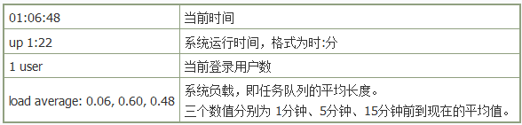

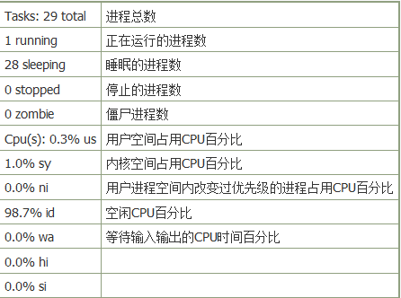

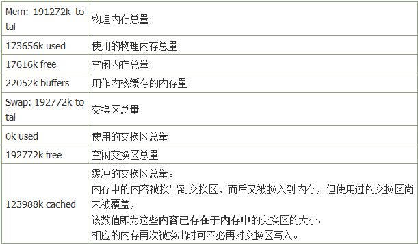

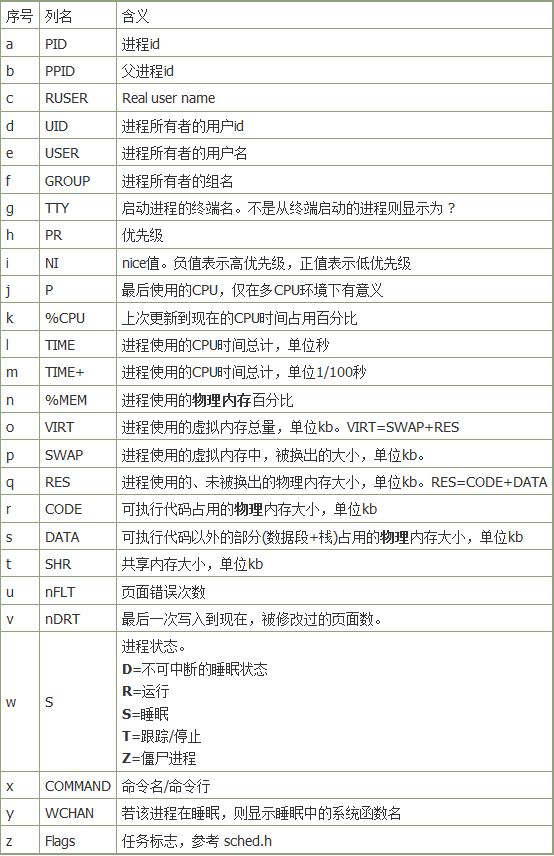

## df和du
df和du命令用于磁盘使用情况查看. 之所以介绍着两个命令是由于出现过由于磁盘空间被占满导致应用访问不了的问题.

### df
检查文件系统的磁盘空间占用情况。可以利用该命令来获取硬盘被占用了多少空间，目前还剩下多少空间等信息。

#### 基本用法
- --block-size=[digit]: 以block-size为单位
- -k: 等价于 --block-size=1K
- -m: 等价于 --block-size=1m

### du
显示用于文件的块数量。如果指定的 File 参 数实际上是一个目录，就要报告该目录内的所有文件。如果没有提供 File 参数， du 命令使用当前目录内的文件。

#### 基本用法
- -a: 为每个指定文件显示磁盘使用情况，或者为目录中每个文件显示各自磁盘使用情况。默认以512B作为单位
- -k: 用 1024 字节单位计算块数
- -m:　用 1ｍ 字节单位计算块数

目前我们的应用都是J2EE应用, 因此下面将介绍一些JDK自带的诊断工具.

## jps
如果你不想使用`ps|grep xxx`命令的话,这是个不错的选择

### 基本用法
- 不带参数:　显示 "pid    MainClass"
- -q: 只显示pid
- -m: 输出传递给main方法的参数
- -l: 输出main class完整路径名
- -v: 输出传递给jvm的参数

## jstat
jstat全称"Java Virtual Machine statistics monitoring tool",其可谓是JVM内存和GC使用的分析利器. 

### 基本用法
使用格式: jstat &lt;-options&gt; [-t] &lt;vmid&gt; [interval] [count]
说明如下:

**options可取如下值:**

- class(类加载器): 显示加载class的数量，及所占空间等信息
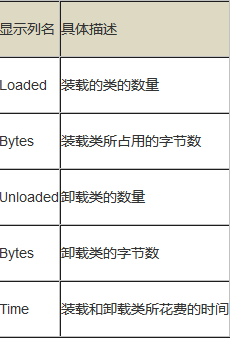
	
- compiler (JIT): 显示VM实时编译的数量等信息
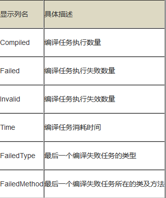

- gc(GC堆状态): 可以显示gc的信息，查看gc的次数，及时间(**注意: 单位是KB而不是byte**)
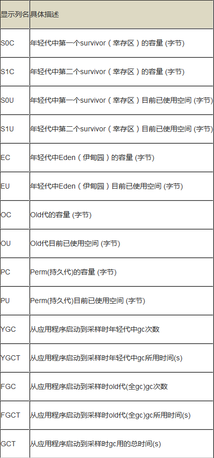

- gccapacity(各区大小): 显示VM内存中三代（young,old,perm）对象的使用和占用大小 (**注意: 单位是KB而不是byte**)
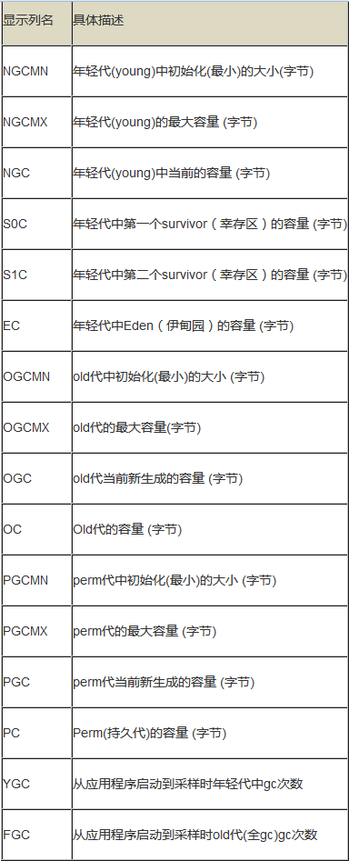

- gcutil(GC统计汇总): 统计gc信息
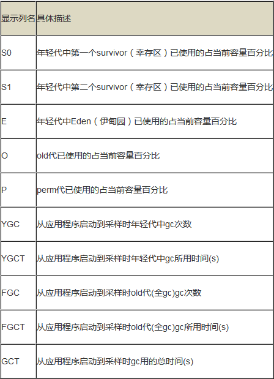

- gcnew(新区统计): 年轻代对象的信息 (**注意: 单位是KB而不是byte**)
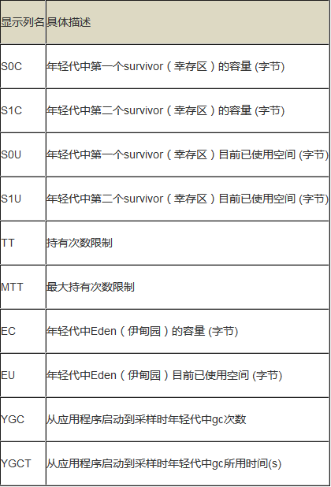

- gcnewcapacity(新区大小): 年轻代对象的信息及其占用量 (**注意: 单位是KB而不是byte**)
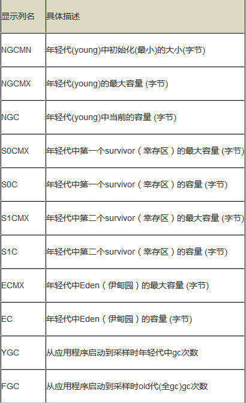

- gcold(老区统计): old代对象的信息 (**注意: 单位是KB而不是byte**)
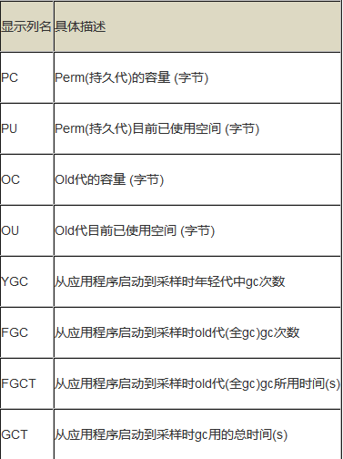

- gcoldcapacity(老区大小): old代对象的信息及其占用量 (**注意: 单位是KB而不是byte**)
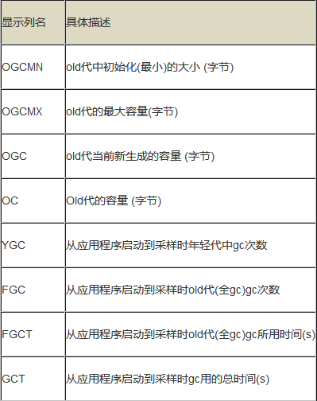

- gcpermcapacity(永久区大小): perm对象的信息及其占用量 (**注意: 单位是KB而不是byte**)
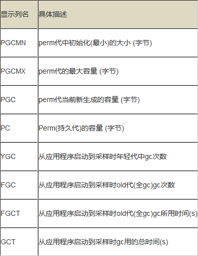

- printcompilation(HotSpot编译统计): 当前VM执行的信息
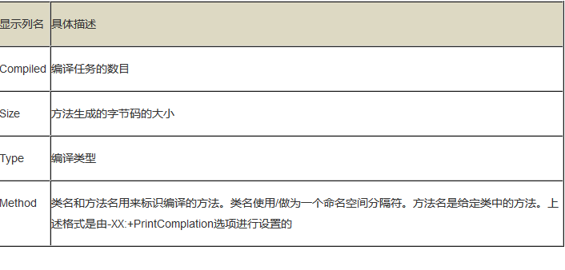

**vmid:jvm的标识符,全称格式为 &lt;lvmid&gt;[@&lt;hostname&gt;[:&lt;port&gt;]]. 当为本机时,后面的主机名和端口可省略, vmid为pid **

**-t:时间间隔, 配合[interval]一起使用 **

**[count]:执行次数 **

## jstack
jstack一般用于打印给定的java进程ID或core file或远程调试服务的Java线程堆栈信息.64位机器需要添加参数 `-J-d64`

Java线程的几种状态包括:

- NEW: 线程刚创建, 尚未启动
- RUNNABLE: 正在正常运行中, 当然可能会有某种耗时计算/IO等待的操作/CPU时间片切换等,  这个状态下发生的等待一般是其他系统资源, 而不是锁, Sleep等 
- BLOCK: 多个线程有同步操作的场景, 比如正在等待另一个线程的synchronized 块的执行释放, 或者可重入的 synchronized块里别人调用wait() 方法, 也就是这里是线程在等待进入临界区
- WAITING: 指线程拥有了某个锁之后, 调用了他的wait方法, 等待其他线程/锁拥有者调用 notify / notifyAll 一遍该线程可以继续下一步操作, **这里要区分 BLOCKED 和 WATING 的区别, 一个是在临界点外面等待进入, 一个是在临界点里面wait等待别人notify, 线程调用了join方法 join了另外的线程的时候, 也会进入WAITING状态, 等待被他join的线程执行结束**
- TIMED_WAITING: 就是有限的(时间限制)的WAITING, 一般出现在调用wait(long), join(long)等情况下, 另外一个线程sleep后, 也会进入TIMED_WAITING状态
- TERMINATED: 表示该线程的run方法已经执行完毕了, 基本上就等于死亡了(当时如果线程被持久持有, 可能不会被回收)

jstat除了标出线程状态, 还说明了是何原因进入此状态:

- runnable(RUNNABLE): 正在运行
- wait on condition(WAITING, TIMED_WAITING): 等待某个条件的发生. 最常见的情况是线程在等待网络的读写，比如当网络数据没有准备好读时，线程处于这种等待状态. 另外, 线程在sleep
- waiting for monitor entry(BLOCK): 对应"Entry Set"队列,指的是线程同步(*比如synchronized关键字*)未获取同步对象,从而进入到"Entry Set"中
- in Object.wait() (WAITING,TIMED_WAITING): 对应"Wait Set"队列, 指的是线程已经在执行或获取同步锁执行, 但在临界区上发现对象条件没有满足, 从而进入到"Wait Set"中, 等待对象notify()或notifyAll()方法被调用

### 基本用法
	jstack [option] pid  #应用运行的pid
	jstack [option] executable core  # kill -3 产生的core dump文件,需打开 ulimit -c coresize限制
	jstack [option] [server-id@]remote-hostname-or-IP	#远程java应用

	参数选项:
	-F: 强制打印线程堆栈信息, 一般对应无响应的情况
	-l: 打印关于锁的附加信息. 例如属于java.util.concurrent的ownable synchronizer列表
	-m: 打印java和native所有栈信息
 
jstack 线程dump文件可被很多工具进行分析, 比如JDK自带的visualvm, 不过我觉得不太直观, 推荐个  [Thread Dump Analyzer](https://java.net/projects/tda/downloads/download/tda-bin-2.2.zip "tda下载地址") 

## jmap
jmap用于显示java进程的堆内存使用信息.一般会被用于生产heap dump文件以便于jhat或MAT等工具的分析

### 基本用法
	jmap [option] pid
	jmap [option] executable core
	jmap [option] [server-id@] remote-hostname-or-ip

	参数选项:
	-heap : 打印heap的概要信息，GC使用的算法，heap的配置及wise heap的使用情况
	-histo[:live]: 打印每个class的实例数目,内存占用,类全名信息. VM的内部类名字开头会加上前缀”*”. 如果live子参数加上后,只统计活的对象数量
	-permstat : 打印classload和jvm heap永久代的信息. 包含每个classloader的名字,活泼性,地址,父classloader和加载的class数量. 另外,内部String的数量和占用内存数也会打印出来
	-finalizerinfo : 打印正等候回收的对象的信息
	-dump:[live,]format=b,file=filename : 使用hprof二进制形式,输出jvm的heap内容到文件. live子选项是可选的，假如指定live选项,那么只输出活的对象到文件
	-F : 强迫.在pid没有响应的时候使用-dump或者-histo参数. 在这个模式下,live子参数无效

## jhat
jhat是配合jmap进行java进程内存分析的工具. 它可以分析jmap导出的heap dump文件.

### 基本用法
	jhat [-stack <bool>] [-refs <bool>] [-port <port>] [-baseline <file>] [-debug <int>] <file>

	参数选项:
	-stack: 关闭对象分配调用栈跟踪(tracking object allocation call stack)。 如果分配位置信息在堆转储中不可用. 则必须将此标志设置为 false. 默认值为 true.
	-refs: 关闭对象引用跟踪(tracking of references to objects)。 默认值为 true. 默认情况下, 返回的指针是指向其他特定对象的对象,如反向链接或输入引用(referrers or incoming references), 会统计/计算堆中的所有对象。
	-port: 设置 jhat HTTP server 的端口号. 默认值 7000
	-baseline: 指定一个基准堆转储(baseline heap dump)。 在两个 heap dumps 中有相同 object ID 的对象会被标记为不是新的(marked as not being new). 其他对象被标记为新的(new). 在比较两个不同的堆转储时很有用.
	-debug: 设置 debug 级别. 0 表示不输出调试信息。 值越大则表示输出更详细的 debug 信息.

在IBM推出MAT(Memory Analyzer Tool)之后, jhat使用的就比较少了.
	 