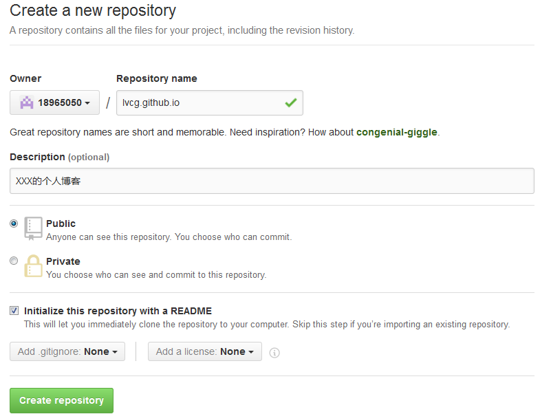



  网上有很多如何在github上创建个人博客的教程,我根据别人的经验,花了一天的时间,终于搭建出了自己的博客(^_^).先将整个流程分享给大家.

- 安装git,并会基本的git操作命令.这个不多说了,还没有使用过git的同学们可参考[廖雪峰的git教程](http://www.liaoxuefeng.com/wiki/0013739516305929606dd18361248578c67b8067c8c017b000 "廖雪峰的git教程") 

- 在github上注册账号并添加本机公钥. 还没有github账号的同学可访问[git官网](http://www.github.com git官网),上面有详细的说明步骤

- github仓储分用户仓储和项目仓储. 我们在上面创建个人仓储.

- 
