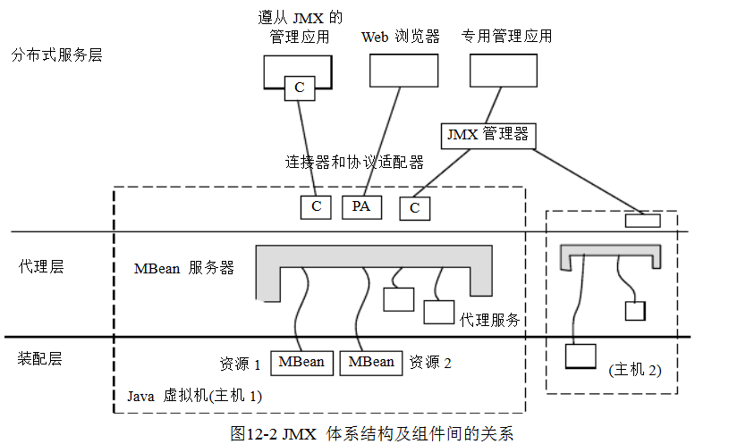
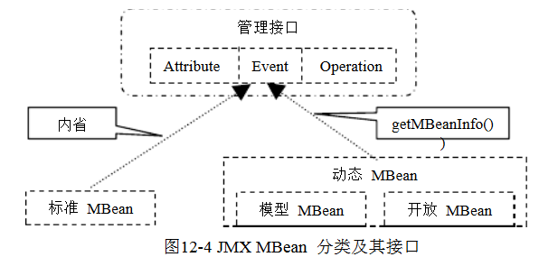

       
    编写这篇文档时, 心里比较诚惶诚恐: 虽然知道这是一些监控平台的常用技术手段, 但平时对JMX的接触不是很多, 且网上关于JMX比较系统性的说明文档不是太多,可参考的文档就更少了.
	代码访问地址:  https://github.com/18965050/jmx-tutorial.git
    希望这篇文档能较简易说明JMX, 同时也欢迎大家多多拍砖

## 什么是JMX
JMX（Java 管理扩展）是一个为应用程序、设备、系统等植入管理功能的框架。同时，作为一种应用编程接口，它可以跨越一系列异构操作系统平台、系统体系结构和网络传输协议，灵活地开发无缝集成的系统、网络和服务管理应用。 

JMX 致力于解决分布式系统管理的问题。为了能够利用功能强大的 Java 计算环境来解决适合于各种不同环境的管理问题，Sun 公司扩充了 Java 基础类库，开发了专用的管理类库。 

JMX 是一套标准的代理和服务，用户可以在任何 Java 应用程序中使用这些代理和服务实现管理。可以管理的资源有网络、设备、应用程序等。

JMX 由一系列相关标准定义了标准的管理模型和管理接口，为管理应用的实现提供了方便。也就是说，它提供了用户界面指导、Java 类和开发集成系统、网络及网络管理应用的规范。

JMX 也是一个完整的网络管理应用程序开发环境，它同时提供了：厂商需要收集的完整的特性清单，可生成资源清单表格，图形化的用户接口；访问 SNMP 的网络 API；主机间远程过程调用；数据库访问方法等等。
 
在JDK的早期版本, JMX还是作为一个JDK的可选包(*optional*). 但在1.5版本中已经被纳入进来的

## 体系结构

JMX体系结构共有三层组成:

- 装配层(Instrumentation Level):  主要包括了一系列的接口定义和描述如何开发MBean的规范。通常JMX所管理的资源由一个或多个MBean组成，资源可以是任何由Java语言开发的组件，或是一个用Java包装器(Wrapper)包装的其他语言开发的资源。

装配层的主要任务就是对资源进行封装，使之成为可管理资源。所谓封装，就是通过将资源用类似 JavaBean 的方式描述出来。当资源以这种方式被封装成为可管理资源后，就被称作MBean(管理Bean，Management Bean)。
    
- 代理层(Agent Level) : 代理是用来管理相应的资源，并且为远端用户提供访问的接口。代理层构建在装配层之上，并且使用管理装配层内部的组件。**通常代理层包含MBean服务器、注册的MBean，并提供一个或多个适配器(Adapter)或连接器(Connector)以供外界的访问**。

代理层的作用体现在内外两方面：对内它通过MBean服务器(Managed Bean Server)维护着MBean的生命周期(包括注册和注销MBean)，同时为所注册的MBean提供各类服务；对外通过连接器将已注册的MBean的管理接口暴露给外面的管理应用使用。

- 分布式服务层(Distributed Service Level): 分布式服务层关心代理如何被远端用户访问的细节。它定义了一系列用来访问代理的接口和组件，包括适配器和连接器的描述。

分布式服务层驻留着管理应用。管理应用通过连接器(*Connector*)与MBean服务器建立连接，并通过管理接口(Management Interface)去访问各个Mbean所包装的可管理资源。
 
## 装配层

### MBean
MBean负责将可管理资源和服务封装成类似Java Bean的形式，代表一个被管理的资源实例。通过MBean的特性可以访问可管理资源的各类信息。MBean对资源的封装体现在以下几个方面：

- 能被接触的属性值(R/W)
- 能够执行的操作(oper-invoke)
- 能发出的通知事件(notification)

MBean分为两种类型：标准(Standard)MBean和动态(Dynamic)MBean。其中动态MBean又进一步分为开放(Open)MBean和模型(Model)MBean

#### 标准MBean
标准管理构件的设计和实现是最简单的，它们的管理接口通过方法名来描述。标准管理构件的实现依靠一组命名规则，称之为设计模式。这些命名规则定义了属性和操作。检查标准管理构件接口和应用设计模式的过程被称为内省（Introspection）[22]。JMX代理通过内省来查看每一个注册在MBean 服务器上的管理构件的方法和超类，看它是否遵从一定设计模式，决定它是否代表了一个管理构件，并辨认出它的属性和操作。

	使用规范:
	1. 接口为实现类名后+"MBean"
	2. 接口和实现类必须放在同一包(*package*)下
	3. 接口实现遵循JavaBean规范

	MBean和MXBean的区别:
	主要是在于在接口中会引用到一些其他类型的类时，其表现方式的不一样。在MXBean中，如果一个MXBean的接口定义了一个属性是一个自定义类型，如MemoryMXBean中定义了heapMemoryUsage属性，这个属性是MemoryUsage类型的，当JMX使用这个MXBean时，这个MemoryUsage就会被转换成一种标准的类型，这些类型被称为开放类型，是定义在javax.management.openmbean包中的。而这个转换的规则是，如果是原生类型，如int或者是String，则不会有变化，但如果是其他自定义类型，则被转换成CompositeDataSupport类。

#### 动态MBean
动态管理构件提供了更大的灵活性，它可以在运行期暴露自己的管理接口。它的实现是通过实现一个特定的接口`javax.management.DynamicMBean`
JMX代理通过getMBeanInfo方法来获取该动态管理构件暴露的管理接口，该方法返回的对象是MbeanInfo类的实例，包含了属性和操作的签名。由于该方法的调用是发生在动态管理构件向MBean服务器注册以后，因此管理接口是在运行期获取的。不同于标准管理构件，JMX代理不需要通过内省机制来确定动态管理构件的管理接口。由于DynamicMBean的接口是不变的，因此可以屏蔽实现细节。由于这种在运行期获取管理接口的特性，动态管理构件提供了更大的灵活性。

	使用规范:
	1. 不需要在自定义以"MBean"结尾的接口, 转而实现DynamicMBean
	2. 组装MBeanInfo实例对象, 并通过 DynamicMBean.getMBeanInfo()接口返回

#### 模型MBean
模型管理构件也是一种专门化的动态管理构件。它是预制的、通用的和动态的 MBean 类，已经包含了所有必要缺省行为的实现，并允许在运行时添加或覆盖需要定制的那些实现。JMX规范规定该类必须实现为`javax.management.modelmbean.RequiredModelMBean`，管理者要做的就是实例化该类，并配置该构件的默认行为并注册到JMX代理中，即可实现对资源的管理。JMX代理通过获得一个ModelMBeanInfo对象来获取管理接口。

	使用规范:
	1. 实现类不需要实现任何接口
	2. 在装配时需要将实现类转为为RequiredModelMBean实例对象, 并在MBean Server中注册
	
#### 开放MBean
开放管理构件是一种专门化的动态管理构件，其中所有的与该管理构件相关的参数、返回类型和属性都围绕一组预定义的数据类型（String、Integer、Float 等）来建立，并且通过一组特定的接口来进行自我描述。JMX代理通过获得一个OpenMBeanInfo对象来获取开放管理构件的管理接口，OpenMBeanInfo是MbeanInfo的子类。

### 通知模型(Notification)
一个管理构件提供的管理接口允许代理对其管理资源进行控制和配置。然而，对管理复杂的分布式系统来说，这些接口只是提供了一部分功能。通常，管理应用程序需要对状态变化或者当特别情况发生变化时作出反映。

为此，JMX定义了通知模型。通知模型仅仅涉及了在同一个JMX代理中的管理构件之间的事件传播。JMX通知模型依靠以下几个部分：

- Notification，一个通用的事件类型，该类标识事件的类型，可以被直接使用，也可以根据传递的事件的需要而被扩展。
- NotificationListener接口，接受通知的对象需实现此接口。
- NotificationFilter接口，作为通知过滤器的对象需实现此接口，为通知监听者提供了一个过滤通知的过滤器。
- NotificationBroadcaster接口，通知发送者需实现此接口，该接口允许希望得到通知的监听者注册。

### 辅助元数据类
辅助元数据类用来描述管理构件。辅助元数据类不仅被用来内省标准管理构件，也被动态管理构件用来进行自我描述。这些类根据属性、操作、构建器和通告描述了管理接口。JMX代理通过这些元数据类管理所有管理构件，而不管这些管理构件的类型。

- MBeanInfo: 包含了属性、操作、构建器和通知的信息。
- MBeanFeatureInfo: 为下面类的超类。
- MBeanAttributeInfo: 用来描述管理构件中的属性。
- MBeanConstructorInfo: 用来描述管理构件中的构建器。
- MBeanOperationInfo: 用来描述管理构件中的操作。
- MBeanParameterInfo: 用来描述管理构件操作或构建器的参数。
- MBeanNotificationInfo: 用来描述管理构件发出的通知。

## 代理层
代理层是一个运行在Java虚拟机上的管理实体，它活跃在管理资源和管理者之间，用来直接管理资源，并使这些资源可以被远程的管理程序所控制。代理层由一个MBean服务器和一系列处理被管理资源的服务所组成。

### MBean Server
Mbean服务器为代理层的核心，设备层的所有管理构件(*MBean*)都在其注册，管理者只有通过它才能访问管理构件。
管理构件可以通过以下三种方法实例化和注册：

- 通过另一个管理构件
- 管理代理本身
- 远程应用程序

注册一个管理构件时，必须提供一个唯一的对象名(*ObjectName*)。管理应用程序用这个对象名进行标识管理构件并对其操作。这些操作包括：

- 发现管理构件的管理接口
- 读写属性值
- 执行管理构件中定义的操作
- 获得管理构件发出的通告
- 基于对象名和属性值来查询管理构件

### 协议适配器和连接器
MBean服务器依赖于协议适配器和连接器来和运行该代理的Java虚拟机之外的管理应用程序进行通信。协议适配器通过特定的协议提供了一张注册在MBean服务器的管理构件的视图。例如，一个HTML适配器可以将所有注册过的管理构件显示在Web 页面上。不同的协议，提供不同的视图。

连接器还必须提供管理应用一方的接口以使代理和管理应用程序进行通信，即针对不同的协议，连接器必须提供同样的远程接口来封装通信过程。当远程应用程序使用这个接口时，就可以通过网络透明的和代理进行交互，而忽略协议本身。

适配器和连接器使MBean服务器与管理应用程序能进行通信。因此，一个代理要被管理，它必须提供至少一个协议适配器或者连接器。面临多种管理应用时，代理可以包含各种不同的协议适配器和连接器。

当前已经实现和将要实现的协议适配器和连接器包括：

- RMI连接器(*这个比较常用*)

如果说Agent只是被Local使用，比如本地的JConsole，只需要开启MBeanServer,并注册MBean即可。不需要配置协议适配器。但如果需要远程管理，比如远程的JConsole或者自定义的管理器，则还需要配置两者相互打交道的协议适配器. 

因为java默认自带的了JMX RMI的连接器。所以，只需要在启动java程序的时候带上运行参数，就可以开启Agent的RMI协议的连接器
	
	-Dcom.sun.management.jmxremote.port = xxxx 
	
	-Dcom.sun.management.jmxremote.authenticate = false|true 

	-Dcom.sun.management.jmxremote.ssl = false|true 

	-Dcom.sun.management.jmxremote.password.file = pathTo/my.password #认证配置

	-Dcom.sun.management.jmxremote.access.file = pathTo/my.access #授权配置

	其中, my.password文件内容举例为:
	user1 password1
	user2 password2

	my.access文件内容举例为:
	user1 readOnly
	user2 readWrite \
      create jmx.*,javax.management.timer.* \
      unregister

- SNMP协议适配器
- IIOP协议适配器
- HTML协议适配器
- HTTP连接器

## 服务层
当前，SUN并没有给出这一层的具体规范，下面给出的只是一个简要描述。

该层规定了实现JMX应用管理平台的接口。这一层定义了能对代理层进行操作的管理接口和组件。这些组件能

- 为管理应用程序提供一个接口，以便它通过一个连接器能透明和代理层或者JMX管理资源进行交互。
- 通过各种协议的映射（如SNMP、HTML等），提供了一个JMX代理和所有可管理组件的视图。
- 分布管理信息，以便构造一个分布式系统，也就是将高层管理平台的管理信息向其下众多的JMX代理发布。
- 收集多个JMX 代理端的管理信息并根据管理终端用户的需要筛选用户感兴趣的信息并形成逻辑视图送给相应的终端用户。
- 提供了安全保证。
