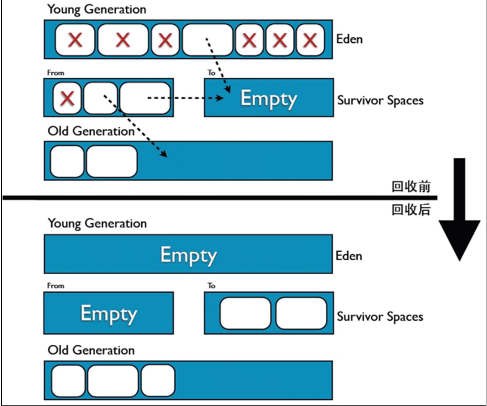

    本文是<<深入理解Java虚拟机>>一书的第三章归档.

## 内存分区管理
JVM的早期版本并没有进行分区管理；这样的后果是JVM进行垃圾回收时，不得不扫描JVM所管理的整片内存，所以搜集垃圾是很耗费资源的事情，也是早期JAVA程序的性能低下的主要原因。随着JVM的发展，JVM引进了分区管理的机制。

采用分区管理机制的JVM将JVM所管理的所有内存资源分为2个大的部分。永久存储区（Permanent Space）和堆空间（The Heap Space）。其中堆空间又分为新生区（Young (New)generation space）和养老区（Tenure (Old) generation space），新生区又分为伊甸园（Eden space），幸存者0区（Survivor0 space）和幸存者1区（Survivor 1 space）。具体分区如下图： 

 

- 永久存储区（Permanent Space）：永久存储区是JVM的驻留内存，用于存放JDK自身所携带的Class,Interface的元数据，应用服务器允许必须的Class,Interface的元数据和Java程序运行时需要的Class和Interface的元数据。被装载进此区域的数据是不会被垃圾回收器回收掉的①，关闭JVM时，释放此区域所控制的内存。

- 堆空间（The Heap Space）：是JAVA对象生死存亡的地区，JAVA对象的出生，成长，死亡都在这个区域完成。堆空间又分别按JAVA对象的创建和年龄特征分为养老区和新生区。

	> 新生区（Young (New) generation space）：新生区的作用包括JAVA对象的创建和从JAVA对象中筛选出能进入养老区的JAVA对象。
	
	> 伊甸园（Eden space）：JAVA对空间中的所有对象在此出生，该区的名字因此而得名。也即是说当你的JAVA程序运行时，需要创建新的对象，JVM将在该区为你创建一个指定的对象供程序使用。创建对象的依据即是永久存储区中的元数据。
	
	> 幸存者0区（Survivor 0 space）和幸存者1区（Survivor 1 space）：当伊甸园的空间用完时，程序又需要创建对象；此时JVM的垃圾回收器将对伊甸园区进行垃圾回收，将伊甸园区中的不再被其他对象所引用的对象进行销毁工作。同时将伊甸园中的还有其他对象引用的对象移动到幸存者0区。幸存者0区就是用于存放伊甸园垃圾回收时所幸存下来的JAVA对象。当将伊甸园中的还有其他对象引用的对象移动到幸存者0区时，如果幸存者0区也没有空间来存放这些对象时，JVM的垃圾回收器将对幸存者0区进行垃圾回收处理，将幸存者0区中不在有其他对象引用的JAVA对象进行销毁，将幸存者0区中还有其他对象引用的对象移动到幸存者1区。幸存者1区的作用就是用于存放幸存者0区垃圾回收处理所幸存下来的JAVA对象。

	> 养老区（Tenure (Old) generation space）：用于保存从新生区筛选出来的JAVA对象。

## 垃圾回收机制
首先当启动J2EE应用服务器时，JVM随之启动，并将JDK的类和接口，应用服务器运行时需要的类和接口以及J2EE应用的类和接口定义文件也及编译后的Class文件或JAR包中的Class文件装载到JVM的永久存储区。在伊甸园中创建JVM，应用服务器运行时必须的JAVA对象，创建J2EE应用启动时必须创建的JAVA对象；J2EE应用启动完毕，可对外提供服务。

JVM在伊甸园区根据用户的每次请求创建相应的JAVA对象，当伊甸园的空间不足以用来创建新JAVA对象的时候，JVM的垃圾回收器执行对伊甸园区的垃圾回收工作，销毁那些不再被其他对象引用的JAVA对象（如果该对象仅仅被一个没有其他对象引用的对象引用的话，此对象也被归为没有存在的必要，依此类推），并将那些被其他对象所引用的JAVA对象移动到幸存者0区。

如果幸存者0区有足够空间存放则直接放到幸存者0区；如果幸存者0区没有足够空间存放，则JVM的垃圾回收器执行对幸存者0区的垃圾回收工作，销毁那些不再被其他对象引用的JAVA对象（如果该对象仅仅被一个没有其他对象引用的对象引用的话，此对象也被归为没有存在的必要，依此类推），并将那些被其他对象所引用的JAVA对象移动到幸存者1区。

如果幸存者1区有足够空间存放则直接放到幸存者1区；如果幸存者1区没有足够空间存放，则JVM的垃圾回收器执行对幸存1者区的垃圾回收工作，销毁那些不再被其他对象引用的JAVA对象（如果该对象仅仅被一个没有其他对象引用的对象引用的话，此对象也被归为没有存在的必要，依此类推），并将那些被其他对象所引用的JAVA对象移动到养老区。

如果养老区有足够空间存放则直接放到养老区；如果养老区没有足够空间存放，则JVM的垃圾回收器执行对养老区区的垃圾回收工作，销毁那些不再被其他对象引用的JAVA对象，并保留那些被其他对象所引用的JAVA对象。如果到最后养老区，幸存者1区，幸存者0区和伊甸园区都没有空间的话，则JVM会报告“JVM堆空间溢出（java.lang.OutOfMemoryError:Java heap space）”，也即是在堆空间没有空间来创建对象。

这就是JVM的内存分区管理，相比不分区来说；一般情况下，垃圾回收的速度要快很多；因为在没有必要的时候不用扫描整片内存而节省了大量时间。通常大家还会遇到另外一种内存溢出错误“永久存储区溢出（java.lang.OutOfMemoryError:Java Permanent Space）”。

 

## 垃圾回收算法
- **标记-清除算法(mark-Sweep)**: 从根节点开始标记所有可达对象，其余没标记的即为垃圾对象，执行清除。但回收后的空间是不连续的。它的缺点是：1.效率低，标记和清除这两个过程效率都不高；2.空间问题，清除之后可能会产生大量的内存碎片，导致大对象无法找到一片连续的内存。
 

- **复制算法(copying)**: 将可用内存分为大小相等的两块，每次只使用其中的一块。当一块的内存用完了，就将还活着的对象复制到另一块上，再把原本那块的内存一次性清理掉，这种算法的缺点是将原本的内存大小缩水了一半。**一般用于Minor-GC**，因为在新生代的对象98%都是朝生夕死的，所以不需要1:1的比例来划分内存，而是分成一块较大的Eden空间和两块较小的Survivor空间，每次使用Eden和其中一块Survivor。当回收时，将Eden和Survivor中还存活的对象一次性拷到另外一块Survivor空间上，最后再清理掉Eden和刚才用过的Survivor空间。
 

- **标记-整理算法(mark-compact)**: 适合用于老年代的算法（存活对象多于垃圾对象）。标记后不复制，而是将存活对象压缩到内存的一端，然后清理边界外的所有对象。
 

## 垃圾回收器
 对于新生代和旧生代，JVM可使用很多种垃圾回收器进行垃圾回收，下图展示了不同生代不同的垃圾回收器，其中两个回收器之间有连线表示这两个回收器可以同时使用。
 

而这些垃圾回收器又分为串行回收方式、并行回收方式和并发回收方式执行，分别运用于不同的场景。如下图所示
 

-  **Serial收集器**

Serial收集器是串行收集器.
 
Serial 收集器是历史最悠久的一个回收器，JDK1.3之前广泛使用这个收集器，目前也是ClientVM下和ServerVM 4核4GB以下机器的默认垃圾回收器。串行收集器并不是只能使用一个CPU进行收集，而是当JVM需要进行垃圾回收的时候，需要中断所有的用户线程，直到它回收结束为止，因此又号称“Stop The World”(*STW*) 的垃圾回收器。注意，JVM中文名称为java虚拟机，因此它就像一台虚拟的电脑一样在工作，而其中的每一个线程就被认为是JVM的一个处理器，因此大家看到图中的CPU0、CPU1实际为用户的线程，而不是真正机器的CPU，大家不要误解哦。

串行回收方式适合低端机器，是Client模式下的默认收集器，对CPU和内存的消耗不高，适合用户交互比较少，后台任务较多的系统。Serial收集器默认新旧生代的回收器搭配为Serial+ SerialOld

	使用参数配置: 
	-XX:+UseSerialGC
	

- **ParNew收集器**

ParNew收集器其实就是多线程版本的Serial收集器.
 
它同样有Stop The World的问题，他是多CPU模式下的首选回收器（该回收器在单CPU的环境下回收效率远远低于Serial收集器，所以一定要注意场景哦），也是Server模式下的默认收集器。

	使用参数配置: 
	-XX:+UseParNewGC
	-XX:+UseConcMarkSweepGC
	-XX:ParallelGCThreads=N，设置并行垃圾回收的线程数，此值可以设置与机器处理机数量一致

- **ParallelScavenge收集器**

ParallelScavenge收集器又被称为是吞吐量优先的收集器. 吞吐量=程序运行时间/(JVM执行回收的时间+程序运行时间),假设程序运行了100分钟，JVM的垃圾回收占用1分钟，那么吞吐量就是99%。在当今网络告诉发达的今天，良好的响应速度是提升用户体验的一个重要指标，多核并行云计算的发展要求程序尽可能的使用CPU和内存资源，尽快的计算出最终结果，因此在交互不多的云端，比较适合使用该回收器.

Parallel Scavenge收集器提供了两个参数用于精确控制吞吐量，分别是控制最大垃圾收集停顿时间的-XX:MaxGCPauseMillis参数以及直接设置吞吐量大小的-XX:GCTimeRatio参数。

	MaxGCPauseMillis: 允许的值是一个大于0的毫秒数，收集器将尽可能地保证内存回收花费的时间不超过设定值。不过大家不要认为如果把这个参数的值设置得稍小一点就能使得系统的垃圾收集速度变得更快，GC停顿时间缩短是以牺牲吞吐量和新生代空间来换取的：系统把新生代调小一些，收集300MB新生代肯定比收集500MB快吧，这也直接导致垃圾收集发生得更频繁一些，原来10秒收集一次、每次停顿100毫秒，现在变成5秒收集一次、每次停顿70毫秒。停顿时间的确在下降，但吞吐量也降下来了。

	GCTimeRatio: 大于0且小于100的整数，也就是垃圾收集时间占总时间的比率，相当于是吞吐量的倒数。如果把此参数设置为19，那允许的最大GC时间就占总时间的5%（即1 /（1+19）），默认值为99，就是允许最大1%（即1 /（1+99））的垃圾收集时间。

	由于与吞吐量关系密切，Parallel Scavenge收集器也经常称为“吞吐量优先”收集器。除上述两个参数之外，Parallel Scavenge收集器还有一个参数-XX:+UseAdaptiveSizePolicy值得关注。这是一个开关参数，当这个参数打开之后，就不需要手工指定新生代的大小（-Xmn）、Eden与Survivor区的比例（-XX:SurvivorRatio）、晋升老年代对象年龄（-XX:PretenureSizeThreshold）等细节参数了，虚拟机会根据当前系统的运行情况收集性能监控信息，动态调整这些参数以提供最合适的停顿时间或者最大的吞吐量，这种调节方式称为GC自适应的调节策略（GC Ergonomics）。如果读者对于收集器运作原来不太了解，手工优化存在困难的时候，使用Parallel Scavenge收集器配合自适应调节策略，把内存管理的调优任务交给虚拟机去完成将是一个不错的选择。只需要把基本的内存数据设置好（如-Xmx设置最大堆），然后使用MaxGCPauseMillis参数（更关注最大停顿时间）或GCTimeRatio（更关注吞吐量）参数给虚拟机设立一个优化目标，那具体细节参数的调节工作就由虚拟机完成了。自适应调节策略也是Parallel Scavenge收集器与ParNew收集器的一个重要区别。

	使用参数配置: 
	-XX:+UseParallelGC(Parallel Scavenge +  Serial Old)
	-XX:+UseParallelOldGC( Parallel Scavenge +  Parallel Old)
	-XX:MaxGCPauseMills 控制最大垃圾收集停顿时间
	-XX:GCTimeRatio 设置吞吐量大小，默认值99
	-XX:+UseAdaptiveSizePolicy 自适应调节，是Parallel Scavenge和ParNew的重要区别

- **ParallelOld收集器**

ParallelOld是老生代并行收集器的一种，使用标记整理算法、是老生代吞吐量优先的一个收集器。这个收集器是JDK1.6之后刚引入的一款收集器，我们看之前那个图之间的关联关系可以看到，早期没有ParallelOld之前，吞吐量优先的收集器老生代只能使用串行回收收集器，大大的拖累了吞吐量优先的性能，自从JDK1.6之后，才能真正做到较高效率的吞吐量优先。
 

	使用参数配置: 
	-XX:+UseParallelOldGC( Parallel Scavenge +  Parallel Old)

- **SerialOld收集器**

SerialOld是旧生代Client模式下的默认收集器，单线程执行；在JDK1.6之前也是ParallelScvenge回收新生代模式下旧生代的默认收集器，同时也是并发收集器CMS回收失败后的备用收集器。
 

	使用参数配置: 
	-XX:+UseParallelGC(Parallel Scavenge +  Serial Old)

- **CMS收集器(Concurrent Mark Sweep Collector)**

CMS又称响应时间优先(最短回收停顿)的回收器，使用并发模式回收垃圾，使用标记-清除算法，CMS对CPU是非常敏感的，它的回收线程数=（CPU+3）/4，因此当CPU是2核的时候，回收线程将占用的CPU资源的50%，而当CPU核心数为4时仅占用25%。

CMS垃圾收集分为4个阶段:  

	初始标记(initial mark): 收集根引用，这是一个stop-the-world阶段。

	并发标记(concurrent mark) : 这个阶段可以和用户应用并发进行。遍历老年代的对象图，标记出活着的对象。

	并发预清理（concurrent preclean）: 这同样是一个并发的阶段。主要的用途也是用来标记，用来标记那些在前面标记之后，发生变化的引用。主要是为了缩短remark阶段的stop-the-world的时间。

	重新标记(remark): 这是一个stop-the-world的操作。暂停各个应用，统计那些在发生变化的标记。

	并发清除(concurrent sweep): 并发扫描整个老年代，回收一些在对象图中不可达对象所占用的空间。

	并发重置（concurrent reset）：重置某些数据结果，以备下一个回收周期开始。

 

	使用参数配置: 
	-XX:+UseConcMarkSweepGC
	-XX:CMSInitiatingOccupancyFraction: 触发百分比，以降低内存回收次数提高性能。要是CMS运行期间预留的内存无法满足程序其他线程需要，就会出现“Concurrent Mode Failure”失败，这时候虚拟机将启动后备预案：临时启用Serial Old收集器来重新进行老年代的垃圾收集，这样停顿时间就很长了。所以说参数-XX:CMSInitiatingOccupancyFraction设置的过高将会很容易导致“Concurrent Mode Failure”失败，性能反而降低。
	-XX:UseCMSCompactAtFullCollection: 用于在Full  GC之后增加一个碎片整理过程
	-XX:CMSFullGCBeforeCompaction: 置执行多少次不压缩的Full  GC之后，跟着来一次碎片整理过程。

- **G1收集器(Garbage First Collector)**

这是一个新的垃圾回收器，既可以回收新生代也可以回收旧生代，SunHotSpot 1.6u14以上EarlyAccess版本加入了这个回收器，sun公司预期SunHotSpot1.7发布正式版，他是商用高性能垃圾回收器，通过重新划分内存区域，整合优化CMS，同时注重吞吐量和响应时间，但是杯具的是被oracle收购之后这个收集器属于商用收费收集器，因此目前基本上没有人使用，在这里也就不多介绍，更多信息可以参考oracle新版本JDK说明。

	使用参数配置:
	-XX:+UseG1GC

##JVM内存分配参数

| 配置 | 说明 |
| ----- | ----- |
| -Xms512m | 设置JVM初始内存为512m. 此值可以设置与-Xmx相同，以避免每次垃圾回收完成后JVM重新分配内存。|
| -Xmx512m | 设置JVM实例堆最大可用内存为512m。|
| -Xmn192m | 设置年轻代大小为192m。整个JVM内存大小=年轻代大小 + 年老代大小 + 持久代大小。持久代一般固定大小为64m，所以增大年轻代后，将会减小年老代大小。此值对系统性能影响较大，Sun官方推荐配置为整个堆的3/8。|
| -Xss128k | 设置每个线程的堆栈大小为128k。JDK5.0以后每个线程堆栈大小为1M，以前每个线程堆栈大小为256K。更具应用的线程所需内存大小进行调整。在相同物理内存下，减小这个值能生成更多的线程。但是操作系统对一个进程内的线程数还是有限制的，不能无限生成，经验值在3000~5000左右。|
| -XX:NewRatio=4 | 设置年轻代（包括Eden和两个Survivor区）与年老代的比值（除去持久代）。设置为4，则年轻代与年老代所占比值为1：4，年轻代占整个堆栈的1/5。|
| -XX:SurvivorRatio=4 | 设置年轻代中Eden区与Survivor区的大小比值。设置为4，则两个Survivor区与一个Eden区的比值为2:4，一个Survivor区占整个年轻代的1/6。|
| -XX:PermSize=128M | 设置持久代大小为128M |
| -XX:MaxPermSize=128M | 设置持久代最大为128M |

### 备注:
①: 按前一篇文章说法, 永久区内容并非不回收, 不同公司实现各有不同