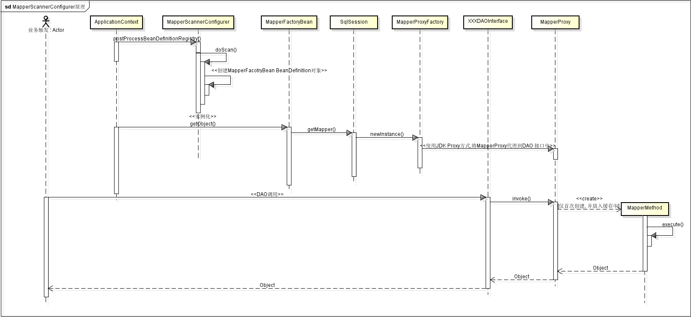

    本文介绍在我们开发框架中使用基于接口动态代理的方式使用MyBatis, 以及MyBatis分页和MyBatis Generator的一些说明
    
## 基于接口动态代理方式使用MyBatis
MyBatis内部有个MapperFactoryBean,用于动态创建mapper接口的代理实例,接口方法的调用转为接口代理类MapperProxy的invoke方法调用(*MapperProxy使用的JDK的动态代理方式, 实现了InvocationHandler接口*)
其基本配置为:


  <bean id="sqlSessionFactory" class="org.mybatis.spring.SqlSessionFactoryBean">
    <property name="dataSource" ref="dataSource"/>
    <!-- 自动扫描entity目录, 省掉Configuration.xml里的手工配置 -->
    <property name="typeAliasesPackage" value="cn.xyz.io.product.basic.entity"/>
    <!-- 指定MyBatis配置文件 -->
    <property name="configLocation" value="classpath:/mybatis/mybatis-config.xml"/>
    <property name="mapperLocations" value="classpath:/mybatis/xml/**/*.xml"/>
  </bean>

  <bean id="userMapper" class="org.mybatis.spring.mapper.MapperFactoryBean">
    <property name="mapperInterface" value="cn.xyz.io.product.basic.repository.mapper.CatalogMapper" />
    <property name="sqlSessionFactory" ref="sqlSessionFactory" />
  </bean>


但这种方式对于大量接口配置起来很麻烦. 因此MyBatis中提供了MapperScannerConfigurer类, 用于扫描某个包下的接口, 进行接口的动态代理


  <bean class="org.mybatis.spring.mapper.MapperScannerConfigurer">
    <!-- 基本包路径, 该路径下所有接口(不包括匿名的, 内部的接口) -->
    <property name="basePackage" value="cn.xyz.io.product.basic.repository"/>
    <!-- 扫描以此注解注解的接口 -->
    <property name="annotationClass" value="cn.xyz.chaos.orm.mybatis.MyBatisRepository"/>
    <property name="sqlSessionFactory" ref="sqlSessionFactory"/>
  </bean>


其原理如下:

## MyBatis配置说明
Mybatis的官方说明文档: http://www.mybatis.org/mybatis-3/ ( 中文: http://www.mybatis.org/mybatis-3/zh/index.html)

其配置说明可参见: http://www.mybatis.org/mybatis-3/zh/configuration.html#settings

其中有个配置项需要注意: defaultExecutorType 当设置为BATCH时, 不会返回数据更新的条数

## 分页
MyBatis默认的分页(*使用RowBound分页*)是内存分页: 也就是先查询出所有的结果, 再在结果集上进行分页结果返回.这种方式对于大结果集分页展示并不是很合适.
GitHub上有个针对Mybatis的分页组件: [mybatis-paginator](https://github.com/miemiedev/mybatis-paginator "mybatis-paginator")
其原理是在MyBatis执行器(*Executor*)在具体执行SQL语句前, 以插件Plugin的方式进行拦截(*org.apache.ibatis.plugin.Interceptor*), 对获取到的MappedStatement,Parameter,RowBound,ResultHandler参数进行
修改, 从而达到修改SQL语句,实现物理分页的目的

## MyBatis Generator
MyBatis Generator就像iBatis的iBator组件,用于自动生成POJO, DAO, SQL配置等文件的生成
其相应的文档在: [MyBatis Generator](http://mbg.cndocs.tk "MyBatis Generator")

## 推荐
网上有个"深入浅出MyBatis"系列文章, 值得学习一下.

