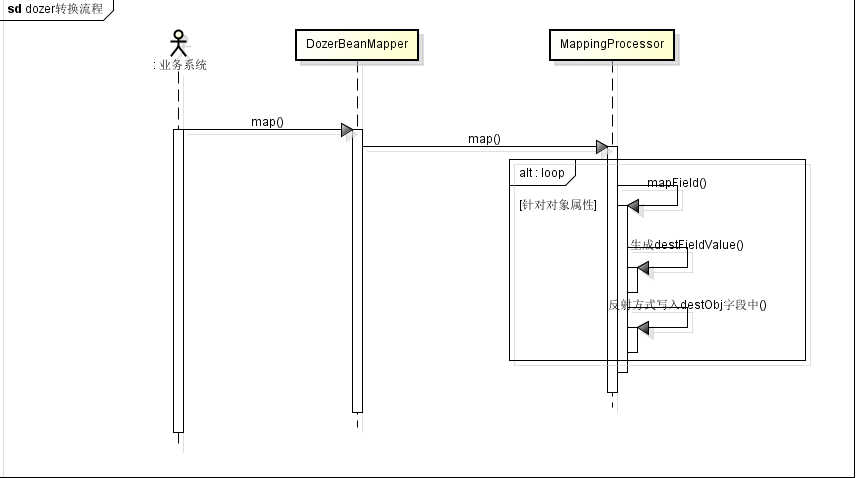
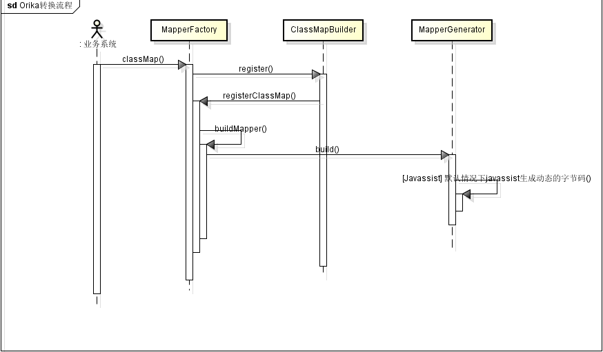



    项目之前在进行Bean相互转换的时候使用的Dozer组件, Dozer的确很强大, 通过XML文件的配置,
    可以很方便的支持不同对象的默认属性值拷贝, 递归转换, 自定义转换, 事件通知等等, 这比使用
    原始的BeanUtils.copyProperties()要方便很多.
    但渐渐的, 我们发现Dozer对象转换性能不是很高. 分析了下源码, 发现每次进行对象转换, 都是
    通过Java的反射机制来实现的, 转换流程简单描述如下:

   

	关键在于对bean中的字段转换使用的是Java的反射机制, 且在进行转换前进行了大量的数据,类型校验, 事件监听触发, 统计等操作. 另外, 发现每次调用DozerBeanMapper.map()方法时都会重新生成一个MappingProcessor对象, 也就是说上述的转换流程要重新走一次

	在我们的新项目中, 我们使用了新的Bean对象转换工具:Orika.按照其官方的说法, 这是个"simpler, lighter and faster Java bean mapping", 其性能大概是Dozer转换速度的8~10倍, 但这是为什么呢. 
	分析了一下Orika的源码, 发现原来是进行对象映射注册时, Orika使用Javassist动态的生成了映射关系类. 这样在转换时, 变成了动态生成方法的调用, 而不是通过反射机制. 其核心转换流程在于:

   

	一个动态生成字节码对应的源码为:

```java
	package ma.glasnost.orika.generated;
	
	public class Orika_TemplateDTO_ProdConfigTemplate_Mapper26817483405686$0 extends ma.glasnost.orika.impl.GeneratedMapperBase {
	
		public void mapAtoB(java.lang.Object a, java.lang.Object b, ma.glasnost.orika.MappingContext mappingContext) {
	
	
	super.mapAtoB(a, b, mappingContext);
	
	
	// sourceType: ProdConfigTemplate
	cn.xyz.io.product.basic.entity.ProdConfigTemplate source = ((cn.xyz.io.product.basic.entity.ProdConfigTemplate)a); 
	// destinationType: TemplateDTO
	cn.xyz.io.product.config.dto.TemplateDTO destination = ((cn.xyz.io.product.config.dto.TemplateDTO)b); 
	
	
	if ( !(((java.lang.Long)source.getCreateId()) == null)){ 
	destination.setCreateId(((java.lang.Long)source.getCreateId())); 
	}
	if ( !(((java.util.Date)source.getCreateTime()) == null)){ 
	destination.setCreateTime(((java.util.Date)((ma.glasnost.orika.Converter)usedConverters[0]).convert(((java.util.Date)source.getCreateTime()), ((ma.glasnost.orika.metadata.Type)usedTypes[0])))); 
	}
	if ( !(((java.lang.String)source.getExplanation()) == null)){ 
	destination.setExplanation(((java.lang.String)source.getExplanation())); 
	}
	if ( !(((java.lang.Long)source.getModifyId()) == null)){ 
	destination.setModifyId(((java.lang.Long)source.getModifyId())); 
	}
	if ( !(((java.util.Date)source.getModifyTime()) == null)){ 
	destination.setModifyTime(((java.util.Date)((ma.glasnost.orika.Converter)usedConverters[0]).convert(((java.util.Date)source.getModifyTime()), ((ma.glasnost.orika.metadata.Type)usedTypes[0])))); 
	}
	if ( !(((java.lang.String)source.getName()) == null)){ 
	destination.setName(((java.lang.String)source.getName())); 
	}
	if ( !(((java.lang.Long)source.getPower()) == null)){ 
	destination.setPower(((java.lang.Long)source.getPower())); 
	}
	if ( !(((java.lang.Integer)source.getStatus()) == null)){ 
	destination.setStatus(((java.lang.Integer)source.getStatus())); 
	}
	if ( !(((java.lang.Long)source.getTemplateId()) == null)){ 
	destination.setTemplateId(((java.lang.Long)source.getTemplateId())); 
	}
			if(customMapper != null) { 
				 customMapper.mapAtoB(source, destination, mappingContext);
			}
		}
	
		public void mapBtoA(java.lang.Object a, java.lang.Object b, ma.glasnost.orika.MappingContext mappingContext) {
	
	
	super.mapBtoA(a, b, mappingContext);
	
	
	// sourceType: TemplateDTO
	cn.xyz.io.product.config.dto.TemplateDTO source = ((cn.xyz.io.product.config.dto.TemplateDTO)a); 
	// destinationType: ProdConfigTemplate
	cn.xyz.io.product.basic.entity.ProdConfigTemplate destination = ((cn.xyz.io.product.basic.entity.ProdConfigTemplate)b); 
	
	
	if ( !(((java.lang.Long)source.getCreateId()) == null)){ 
	destination.setCreateId(((java.lang.Long)source.getCreateId())); 
	}
	if ( !(((java.util.Date)source.getCreateTime()) == null)){ 
	destination.setCreateTime(((java.util.Date)((ma.glasnost.orika.Converter)usedConverters[0]).convert(((java.util.Date)source.getCreateTime()), ((ma.glasnost.orika.metadata.Type)usedTypes[0])))); 
	}
	if ( !(((java.lang.String)source.getExplanation()) == null)){ 
	destination.setExplanation(((java.lang.String)source.getExplanation())); 
	}
	if ( !(((java.lang.Long)source.getModifyId()) == null)){ 
	destination.setModifyId(((java.lang.Long)source.getModifyId())); 
	}
	if ( !(((java.util.Date)source.getModifyTime()) == null)){ 
	destination.setModifyTime(((java.util.Date)((ma.glasnost.orika.Converter)usedConverters[0]).convert(((java.util.Date)source.getModifyTime()), ((ma.glasnost.orika.metadata.Type)usedTypes[0])))); 
	}
	if ( !(((java.lang.String)source.getName()) == null)){ 
	destination.setName(((java.lang.String)source.getName())); 
	}
	if ( !(((java.lang.Long)source.getPower()) == null)){ 
	destination.setPower(((java.lang.Long)source.getPower())); 
	}
	if ( !(((java.lang.Integer)source.getStatus()) == null)){ 
	destination.setStatus(((java.lang.Integer)source.getStatus())); 
	}
	if ( !(((java.lang.Long)source.getTemplateId()) == null)){ 
	destination.setTemplateId(((java.lang.Long)source.getTemplateId())); 
	}
			if(customMapper != null) { 
				 customMapper.mapBtoA(source, destination, mappingContext);
			}
		}
```