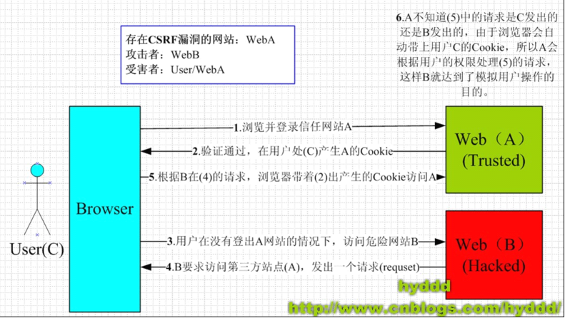

	网站安全问题一直是一个比较容易忽略的领域. 毕竟, 相比较于功能的实现, 性能的提升, 安全漏洞只要不被暴露或攻击, 就不是问题.但事实上, 安全问题又是最严重的问题. 一旦爆发, 网站崩溃倒是小事, 用户信任的丧失, 访问量的减少都会接踵而来.
	文中提到的安全注意事项仅仅是针对业务层及普通开发人员需要注意的一些基本事项, 目的也仅仅是为了增强大家的安全意识.欢迎大家多多拍砖. 

##防止XSS(Cross Site Script)攻击
- 定义: 攻击者往Web页面里插入恶意html代码(或js脚本)，当用户浏览该页访问代码连接时，嵌入其中Web里面的html代码(或脚本)会被执行，从而达到恶意攻击用户的特殊目的
- 类型: 反射型(未存储在数据库中). 保存型(保存至数据库中)
- 解决手段: 转义HTML特殊字符. JSP可使用<c:out />标签(其有个属性 `escapeXml`, 默认为true.表示转义标签中的字符) 

##防止CSRF(Cross-site request forgery)攻击
- 定义: 用户在访问网站A情况下,会生成用户会话(session).当用户使用此会话访问攻击者网站B针对网站A提供的连接时,会话会被劫持.从而造成比如信息修改, 恶意支付等情况. 可通过下图说明:

- 解决手段: 防止会话被劫持. 可通过网站自生成的_token参数是否匹配来解决 
有些网站, 用户未登录和登录情况下的会话权限相同(新一站不存在此情况),这样危害更严重. 在一些Java安全框架, 比如Spring-Security, Shiro等都会创建一新会话,防止登录前会话被劫持

##防止SQL Injection攻击
- 定义: 将sql命令作为页面参数提交给server端,造成实际执行sql和预期sql不一致,从而引起信息泄露,数据篡改等恶意行为
- 解决手段: 使用Prepare Statement. 比如iBatis中通过井号(#)参数引用方式可预防此攻击.

##防止DDos(Distribute Denial-of-Service)攻击
- 定义: 恶意用户将多个计算机联合起来作为攻击平台,利用正常的访问请求,对网站进行攻击.阻塞网络带宽,消耗网站资源, 使正常用户无法正常访问.
- 解决手段: 应用部署各层应均有防DDos攻击的配置.越靠前的防御,效果越好. 
  这里我们只说下应用层的防御.目前我们采用的是:  
	单会话单位时间访问请求数限制(防请求过频)  
	单IP单位时间产生会话数限制(防页面打开数过多)

##防止MITM(Man-In-the-Mirror)攻击 
- 定义:　攻击者利用HTTP抓包工具获取用户身份等敏感信息,从而可操作用户,对用户支付, 账户等信息造成破坏.
- 解决手段: 涉及用户敏感信息的操作: 比如登录, 支付, 账户安全(改密, 手机邮箱绑定)等走HTTPS

##防止资源被恶意轰炸
- 定义:　攻击者通过暴露的请求, 恶意消费应用平台的资源, 比如大量无效的数据, 短信, 邮件等
- 解决手段:  
	 (1) 数据有效性检验--针对无效数据  
	 (2) 通过特定标识: 比如token或图形验证码等,这些标识每次使用均需唯一生成

##预防文件访问漏洞
- 定义: Java安全沙箱可确保远程非可信代码只能在受限环境中执行.但提供的文件访问连接如果有路径配置参数, 需注意路径范围限定.防止攻击者通过路径篡改获取server信息, 甚至操作机器.
- 解决手段: 限制路径访问范围

##限制敏感cookie
- 定义: 有些敏感cookie会用来当做诸如登录认证,支付等操作. 对于这些cookie,应严格对其进行保护
- 解决手段:  
	(1) 设置失效时间 : 会话级还是时间级 
	(2) cookie值加密, 且不能永久有效, 防止被盗cookie永久有效  
	(3) 考虑设置HttpOnly属性, 防止js脚本获取cookie.  

有些浏览器HttpOnly属性会被js脚本覆盖.详情请看: [某些浏览器中因cookie设置HttpOnly标志引起的安全问题](http://www.freebuf.com/articles/web/31644.html "某些浏览器中因cookie设置HttpOnly标志引起的安全问题") 

Servlet2.5版本原生不支持cookie的HttpOnly属性, 如何绕过此限制网上有很多方法, 这里不细说了.	

##预防穷举机制
- 定义: 攻击者可采用穷举法则对用户敏感信息不断进行试错, 达到获取用户敏感信息的目的
- 解决方法: 增加试错成本. 比如可以通过图形验证码, 限制单位时间试错次数, 提醒被攻击用户提升安全级别等等手段

##及时更新验证标识
- 定义: 图形验证码或token等验证标识是一种有效预防试错穷举的手段, 但要注意及时更新这些标识, 防止被反复使用起不到有效验证的作用
- 解决方法: 及时更新验证标识. 比如更新每次验证请求及验证成功后使之失效 

##不要依据用户输入进行隐私校验
- 定义: 这里指的隐私校验并非登录用户名/密码等信息校验. 而是指用户私密操作(比如改密, 支付等)对用户身份的校验. 这种操作对用户身份的校验必定不能依赖于用户输入的身份信息进行校验.
- 解决方法: 严格上说, 这不能算是一条安全准则. 但事实上,有些不认真的攻城狮的确干过这种事, 因此我单独拿了出来.

##注意注释说明
- 定义: 这里主要指前端注释.注释是给开发人员看的代码说明, 不应流露到外网.给攻击者提供功能和流程的分析, 寻找攻击漏洞
- 解决方法: 前端注释一律使用后端注释风格. 

##遵循LPP原则
LPP指的是最小权限原则(Least-Priviledge-Principle), 原指为满足某种操作所赋予的最小资源权限.这里, 我引申一下,还只暴露的信息最少.

####部署环境权限最小
- 应用部署服务器注意不要使用root账户
- 数据库不要使用DBA权限账户.
- 应用应明确资源分配: CPU, 内存, 磁盘, 网络带宽等 

####不要暴露后门连接
有时候,我们为了测试或维护方便, 会开发一些后门连接.比如缓存定时刷新, 配置重新生效等等. 注意这些功能切不可暴露给普通互联网用户

####暴露连接信息最少
请求链接URL暴露的信息也应遵循LPP原则: 再不影响兼容性的情况下, 如果能用最小的请求参数完成的功能绝不多暴露一个请求参数. 

##关心网上爆出的第三方安全漏洞
有时候,我们所依赖的第三方框架,组件等等也不一定是100%安全可靠的.比如近几年爆出的:

- struts2平台安全漏洞 :(直到 2.3.15.1版本才修复)  
	
	可远程执行服务器脚本代码  
	重定向漏洞

- openSSL"心脏出血"安全漏洞,使攻击者能够从内存中读取多达64KB的数据. 

- redis无密码或弱密码认证导致被远程机器操作控制

##建立监控平台
道高一尺, 魔高一丈. 任何一个平台都不能说是100%安全无忧的.尤其对于安全异常的及时知晓, 才能争取更多的宝贵时间来修复问题, 防止更严重情况的发生.  

(TBC...)