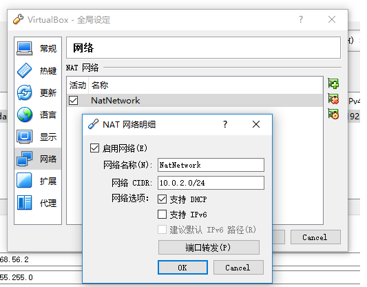
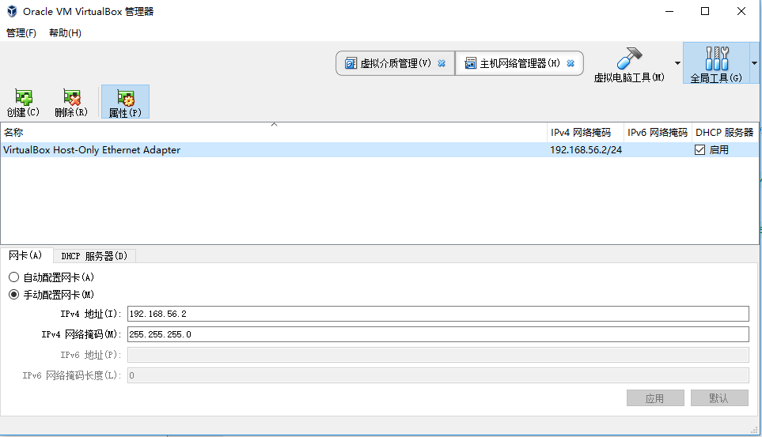
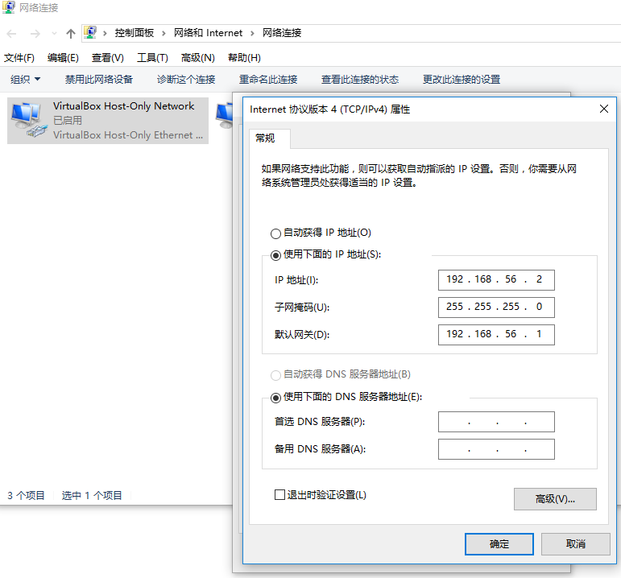
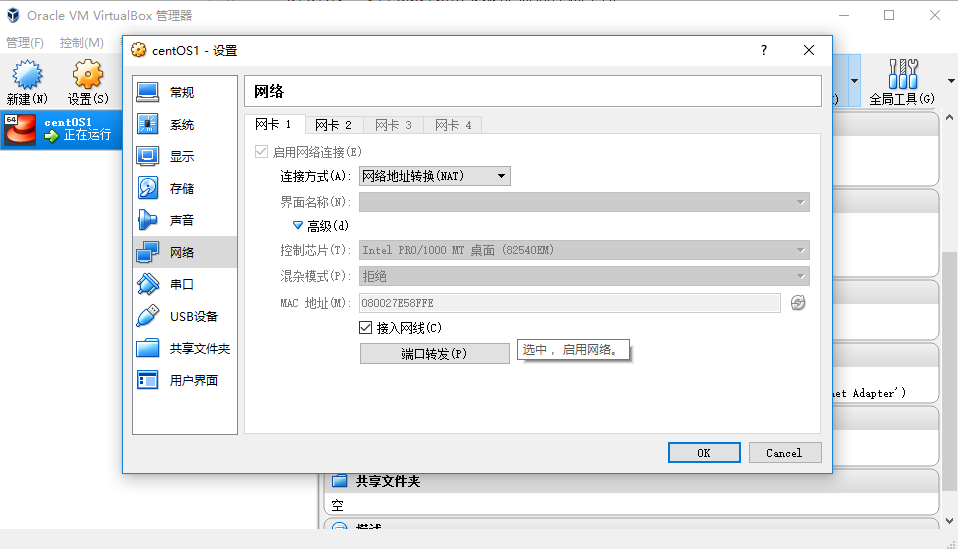
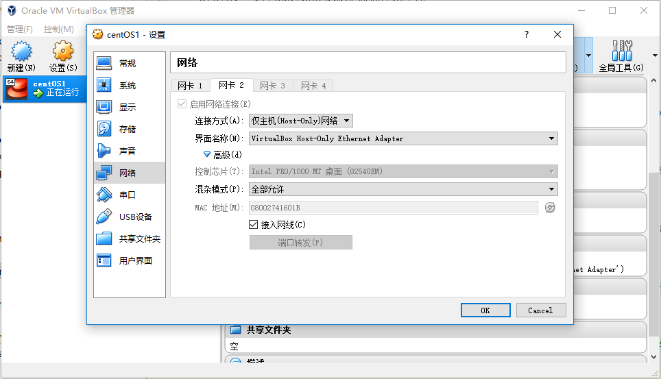



这是在进行virtualbox5.2.12版本安装CentOS7虚机,并保证虚机和主机网络互通的一篇总结.

1. virtualbox全局网络设置需要设置两张网卡,NAT(可使虚机使用主机网络)和Host-Only(配置虚机静态IP).设置分别如下
    
    a. virtualbox "管理"-->"全局设定"-->"网络"中配置NAT网卡
    
     
     
    b. virtualbox右侧 "全局工具"-->"主机网络管理器"设置Host-Only网卡
    
     
          
2. Host-Only设置完成后,可在主机网络连接中看到此网卡

    
    
3. 虚机配置两个网卡. 第一个为NAT, 第二个为Host-Only

    
    
    
    
4. 启动虚机并root登陆,在`/etc/sysconfig/network-scripts/` 目录下可看到两块网卡配置`ifcfg-enp0s3(NAT)`和`ifcfg-enp0s8(Host-Only)`, 分别配置如下:

a. ifcfg-enp0s3(NAT配置, 用于绑定主机网络,DHCP)
    
```properties
TYPE=Ethernet
BOOTPROTO=dhcp     #动态IP
HWADDR=08:00:27:E5:8F:FE   #和虚机NAT网络mac保持一致
NETMASK=255.255.255.0
GATEWAY=10.0.2.0
DEFROUTE=yes           # 注意,作为默认路由
PEERDNS=yes
PEERROUTES=yes
IPV4_FAILURE_FATAL=no
IPV6INIT=yes
IPV6_AUTOCONF=yes
IPV6_DEFROUTE=yes      # 注意,作为默认路由
IPV6_PEERDNS=yes
IPV6_PEERROUTES=yes
IPV6_FAILURE_FATAL=no
NAME=enp0s3            #名称
UUID=1e95182d-aba4-4ce7-b3c7-d9b77b2464f3
DEVICE=enp0s3
ONBOOT=yes    
```
    
b. ifcfg-enp0s8(Host-Only配置, 用于主机访问虚机,static ip)
    
```properties
TYPE=Ethernet
HWADDR=08:00:27:41:60:1B      #和虚机Host-Only网络mac保持一致
BOOTPROTO=static               #静态IP
IPADDR=192.168.56.101
NETMASK=255.255.255.0
GATEWAY=192.168.56.1
DEFROUTE=no                    #注意:关闭默认路由
PEERDNS=yes
PEERROUTES=yes
IPV4_FAILURE_FATAL=no
IPV6INIT=yes
IPV6_AUTOCONF=yes
IPV6_DEFROUTE=no               #注意:关闭默认路由
IPV6_PEERDNS=yes
IPV6_PEERROUTES=yes
IPV6_FAILURE_FATAL=no
NAME=enp0s8                    #名称
UUID=1e95182d-aba4-4ce8-b3c7-d9b77b2464f3      #唯一,和enp0s3不同
DEVICE=enp0s8
ONBOOT=yes
```
    
5 配置完成重启网络, 即可实现虚机和主机网络互通, 且虚机也能访问外网.